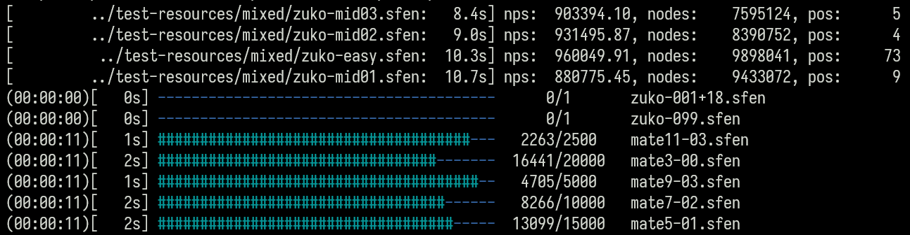

# kh-benchmark



```sh
A benchmarking tool for mate engines

Usage: kh-benchmark [OPTIONS] --engine-path <ENGINE_PATH> [SFEN_PATHS]...

Arguments:
  [SFEN_PATHS]...  The paths to the sfen files to use. It must not be empty

Options:
  -e, --engine-path <ENGINE_PATH>  The path to the engine executable
  -w, --workers <WORKERS>          The number of workers to use [default: 4]
  -t, --threads <THREADS>          The number of threads to use [default: 1]
  -h, --hash <HASH>                The hash size in MB [default: 16]
      --help                       Show help message
  -V, --version                    Print version
```

## License

Licensed under either of Apache License, Version 2.0 or MIT license at your option.
